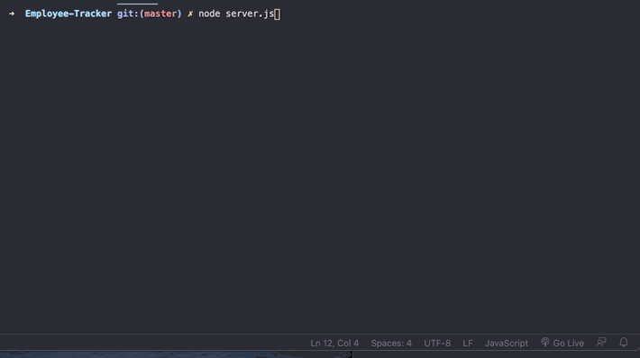

# Employee-Tracker
README

This gif shows all of the view functions running in the terminal

The following gif diplays adding an employee via the terminal.

This gid shows updating an employee role as well as that the employee roll changes in the SQL.

This gif shows adding a new employee roll  via the terminal and it storing the the SQL.
